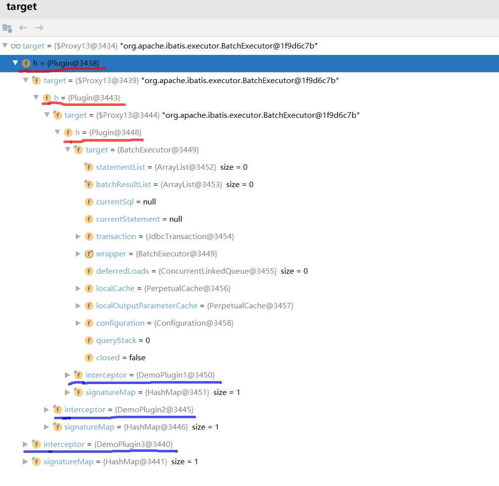
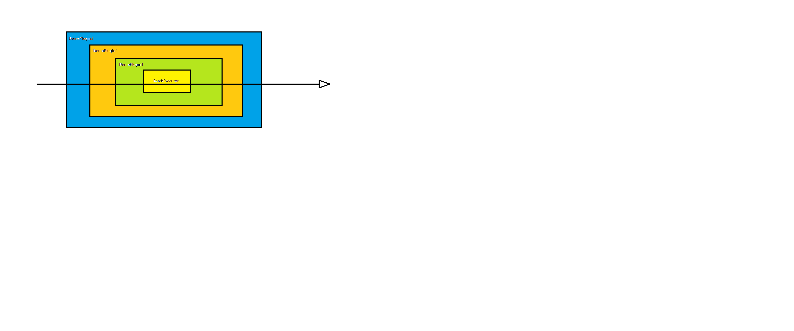
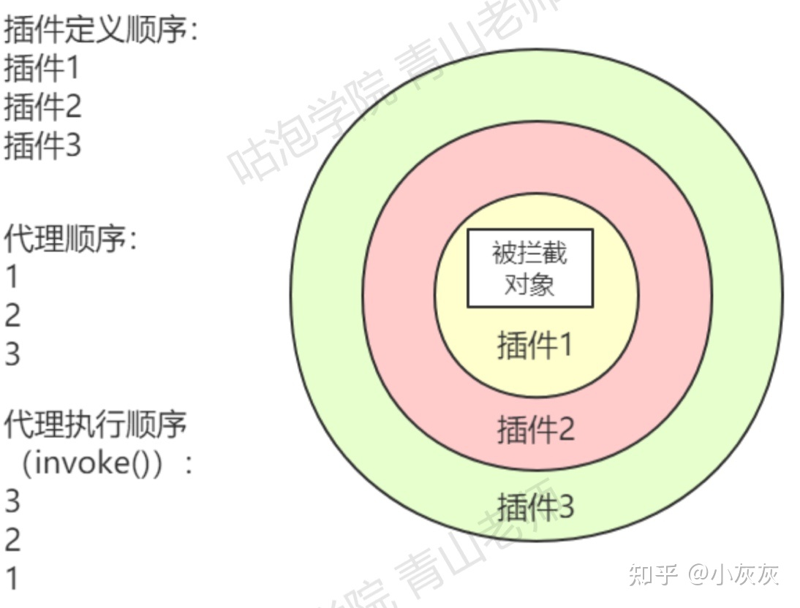

#  关注一下有多个插件时候的运行顺序
配置的顺序和执行的顺序？
配置的顺序和执行的顺序是相反的。InterceptorChain的List是按照插件从上往下的顺序解析、添加的。
而创建代理的时候也是按照list的顺序代理。执行的时候当然是从最后代理的对象开始。

> https://zhuanlan.zhihu.com/p/361101507

# 每个拦截器的intercept方法内的invocation.proceed()的作用
invocation.proceed()只是简单的调用了下target的对应方法，如果target还是个代理，就又回到了上面的Plugin.invoke方法了。这样就形成了拦截器的调用链推进。
> https://my.oschina.net/xianggao/blog/550356